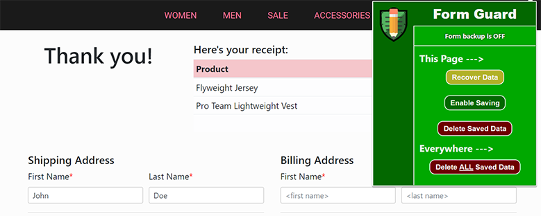
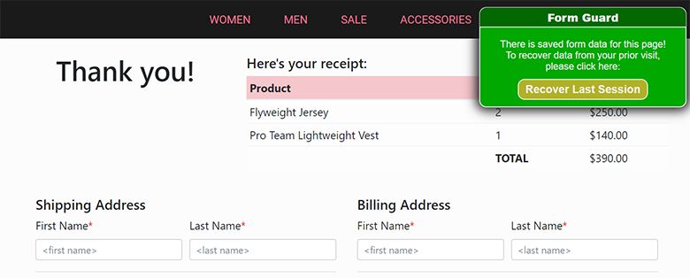

# Form Guard
> A Google Chrome extension that mitigates the frustration of prematurely losing form data

Form Guard is an HTML/CSS/JS browser extension which can detect and backup form data entered on a web page to prevent losing progress in the event of a tab reload, accidental closure, or crash.

* Auto-detects the presence of previously saved data and prompts the user
* Auto-save is initiated by user interaction, so it doesn't save unless you want it too!
* Trys to avoid saving sensitive data (passwords, credit card numbers, SSNs, etc.)
* Saving can be paused by the user at any time.
* Saved data can be deleted on a per page basis, or globally.

## Installation

[Download from the Chrome Web Store](http://)

## Next Steps

- [ ] Encrypt the data being stored
- [ ] Timestamp the data and auto-clear it after a set interval (perhaps 10 days)